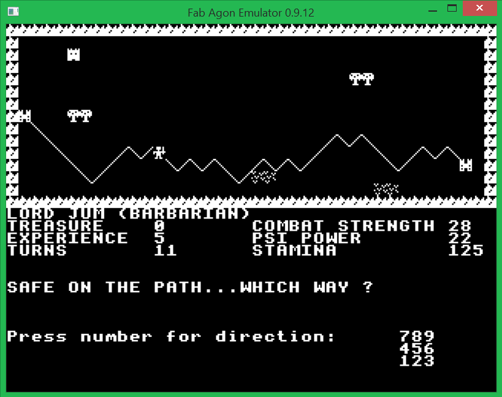

# The-Valley
 Agon Light conversion of The Valley adventure game

Agon Light BBCBASIC conversion by James Higgs 2024.

LLISTed from the Spectravideo 328 version.

Originally from the PET version listed in Computing Today, April 1982

<picture>
    
</picture>

TODO - Add some hostory here, list conversions out there for other machines:

     - BBC, Aquarius+, Windows, etc

## Instructions:

Instructions are in the game, but here are some other tips:

- You can only save your game when in a safe castle, and you exit the game

## Possible future enhancements:
- Add some colour
- Sound effects?
- Different player character for every character class
- Display spells available, and amulet/gems status

